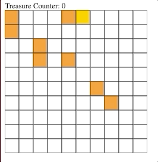
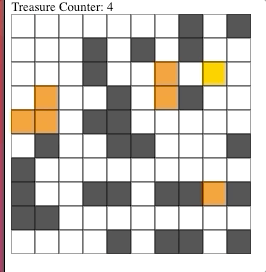

# Using JavaScript to create a basic and experimental treasure hunt game (Building each part under ~30 minutes)

## Part 1

### Basic movements and counting number of treasures found

## Part 2

### Added obstacles and a collision mechanism

